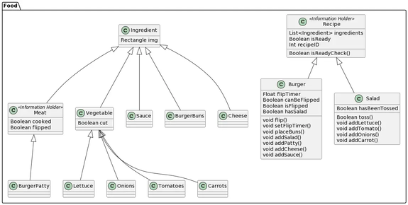
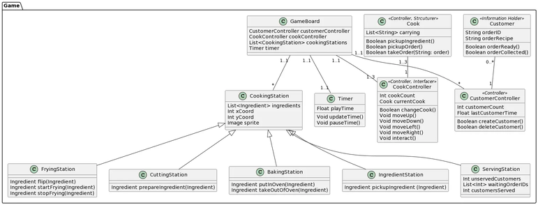

<h2> Architecture Deliverables:</h2>

 Displayed below is our teams architecture documentation, including the final submission for Arch1.pdf.

<h3>Arch1.pdf Documentation</h3>
<a href="Arch1.pdf" download>Click to Download Arch1.pdf</a>
<h3>CRC Cards</h3>

The first stage of our design process was focused on psuedo-implementation, and working on the handwritten CRC Cards below:

<h3>UML Diagrams</h3>

 To complete our design architecture, we built UML diagrams, listed below:

  
      
      
      
      
      

